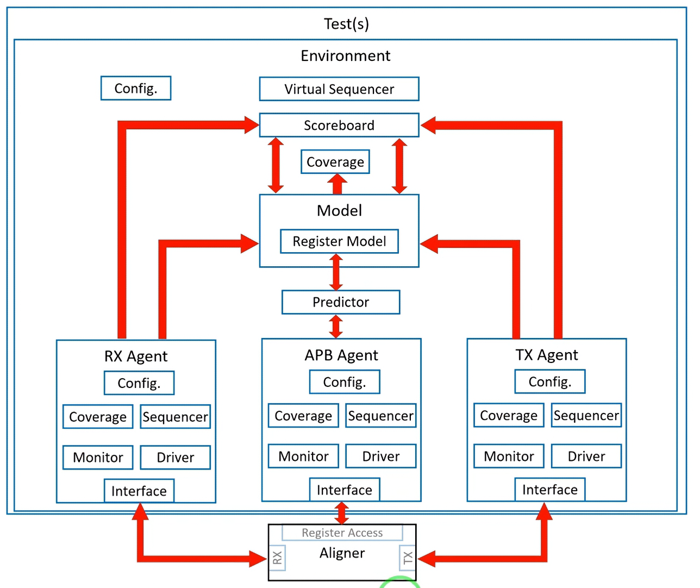

# UVM Verification Environment for Data Aligner IP

A UVM-based verification testbench for a Data Aligner DUT, built using Cadence Xcelium on EDA Playground. The Data Aligner communicates over a custom **Memory Data (MD) Protocol** on its RX/TX data path and a standard **APB** interface for register access.

## Overview

The Data Aligner DUT has three interfaces:

- **RX Interface** — data input, driven using the custom Memory Data Protocol
- **TX Interface** — data output, driven using the custom Memory Data Protocol
- **APB Interface** — register configuration and access, using the standard AMBA APB protocol

This testbench verifies functional correctness across all three interfaces, validates protocol compliance using SystemVerilog Assertions (SVA), and checks data/register integrity using a reference model and scoreboard.

## Architecture



The environment follows a standard layered UVM architecture:

```
Test(s)
└── Environment
    ├── Virtual Sequencer         — coordinates stimulus across all agents
    ├── Scoreboard                — compares DUT outputs against the reference model
    ├── Model
    │   ├── Register Model        — mirrors DUT register state
    │   └── Predictor             — predicts expected DUT behavior from input stimulus
    ├── Coverage                  — environment-level functional coverage
    ├── RX Agent                  — drives/monitors the Memory Data Protocol (input)
    │   ├── Sequencer, Driver, Monitor, Coverage, Config
    ├── APB Agent                 — drives/monitors register access via APB
    │   ├── Sequencer, Driver, Monitor, Coverage, Config
    └── TX Agent                  — drives/monitors the Memory Data Protocol (output)
        ├── Sequencer, Driver, Monitor, Coverage, Config
```

A **Register Access** interface on the Aligner module provides access to the Data Aligner's internal registers via the APB Agent.

### Key components

| Component | Responsibility |
|---|---|
| **Virtual Sequencer** | Coordinates and synchronizes sequences across the RX, TX, and APB agents |
| **Scoreboard** | Collects transactions from all monitors and checks DUT outputs against expected results |
| **Predictor** | Generates expected outputs from input stimulus for scoreboard comparison |
| **Register Model** | Tracks and verifies the DUT's register map, accessed via the APB agent |
| **RX / TX Agents** | Drive and monitor the custom Memory Data Protocol at the aligner's data input/output |
| **APB Agent** | Drives and monitors register reads/writes over the standard APB protocol |

## Verification Methodology

- **Stimulus generation**: Constrained-random sequences generated per agent and coordinated via the virtual sequencer for realistic multi-interface traffic.
- **Protocol checking**: SystemVerilog Assertions (SVA) validate protocol timing and compliance on the APB, RX, and TX (Memory Data Protocol) interfaces.
- **Functional checking**: A reference Predictor model computes expected results, compared against DUT outputs by the Scoreboard.
- **Functional coverage**: Per-agent and environment-level coverage groups track stimulus completeness across all three interfaces.

## Results

- **Functional coverage achieved:** 94%
- **Functional bugs identified:** 4

## Tools

- **Simulator:** Cadence Xcelium
- **Platform:** EDA Playground
- **Languages:** SystemVerilog, UVM

## Repository Structure

```
├── rtl/                 # DUT source
├── tb/
│   ├── top/              # Testbench top + interfaces
│   ├── uvm_ext/          # Reusable UVM base-class library
│   ├── agents/
│   │   ├── apb/          # APB Agent
│   │   └── md/           # Memory Data Agent (RX/TX)
│   ├── env/              # Top-level environment, scoreboard, model, predictor
│   ├── reg_model/        # Register model (block + individual registers)
│   ├── virtual_seq/      # Virtual sequences
│   └── tests/            # UVM test classes
├── docs/                 # Architecture diagram and documentation
└── README.md
```

See [`docs/folder_structure.md`](docs/folder_structure.md) for the full file-by-file breakdown.

## Running the Testbench

1. Open the project on [EDA Playground](https://www.edaplayground.com/).
2. Select **Cadence Xcelium** as the simulator.
3. Load the testbench files and run the desired test.

```bash
# Example (if running locally with Xcelium installed)
xrun -uvm -access +rwc tb_top.sv +UVM_TESTNAME=<test_name>
```

## Author

**Stephen Tagoe**
[GitHub](https://github.com/Stevederoyal) | [LinkedIn](https://linkedin.com/in/stephen-tagoe-7588a61b7/)
